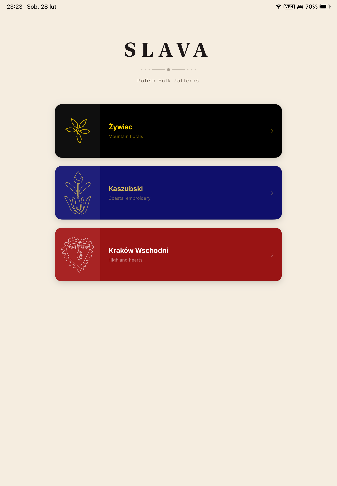
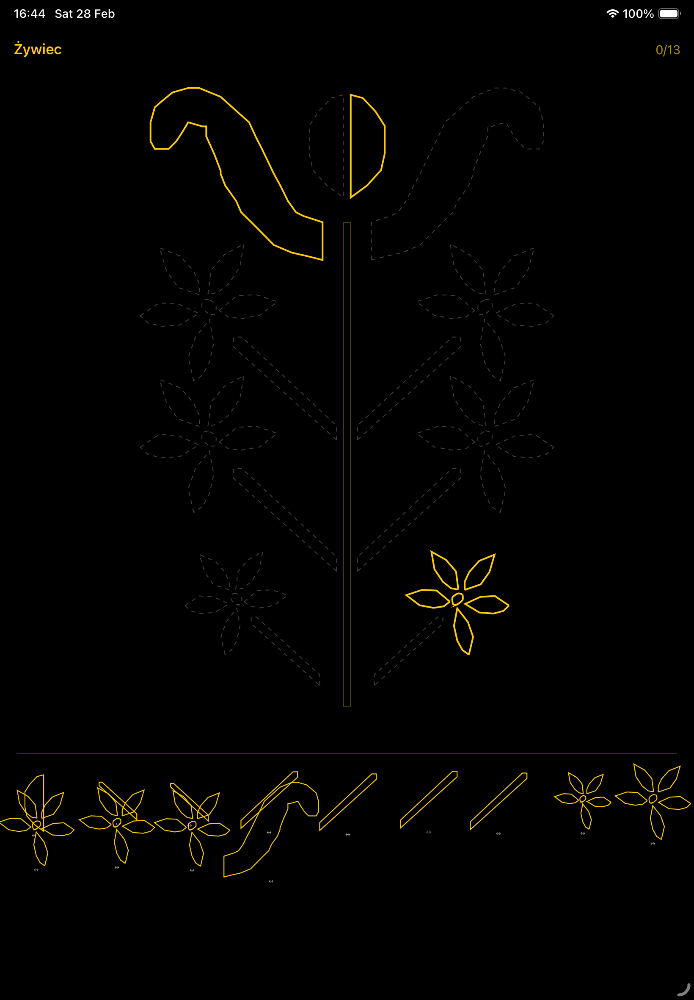
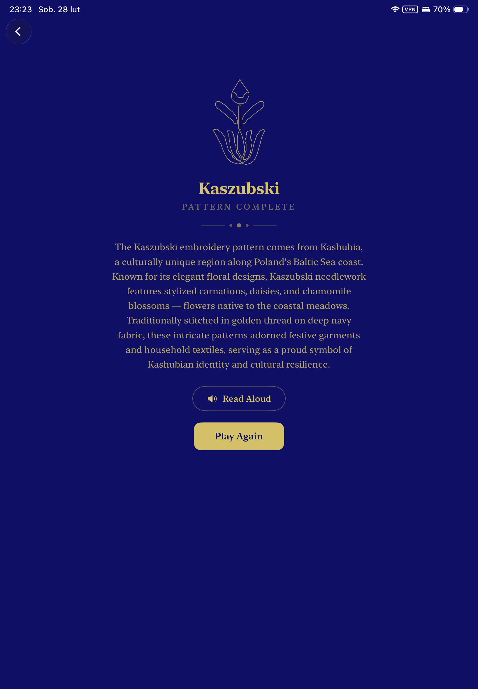
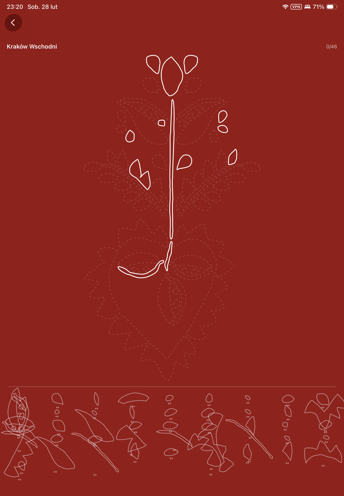

# S L A V A

**Polish Folk Patterns** — An interactive puzzle game celebrating Poland's embroidery heritage.

Built as a Swift Student Challenge 2026 submission.

## About

SLAVA is an educational puzzle game where players reconstruct traditional Polish embroidery patterns by dragging, dropping, and flipping pieces into place. Each completed pattern is accompanied by a cultural description and a text-to-speech "Read Aloud" feature, blending gameplay with heritage education.

## The Patterns

### Zywiec — Mountain Florals
Originating from the Zywiec Valley in the Beskid Mountains of southern Poland. Features bold floral motifs — peonies, roses, and wildflowers — in symmetrical compositions reflecting the mountain community's bond with nature.

### Kaszubski — Coastal Embroidery
From Kashubia, a culturally unique region along Poland's Baltic Sea coast. Features elegant stylized carnations, daisies, and chamomile, traditionally stitched in golden thread on deep navy fabric.

### Krakow Wschodni — Highland Hearts
From eastern Krakow and the Polish Highlands. Distinguished by prominent heart motifs woven among flowing leaves and flowers, traditionally embroidered in white on deep crimson fabric for wedding garments and ceremonial textiles.

## Features

- Three pattern-completion puzzles of increasing difficulty (13 to 42 pieces)
- Drag-and-drop gameplay with snap-to-target mechanics
- Piece flipping for symmetrical pattern placement
- Haptic feedback on correct placement
- Cultural descriptions with text-to-speech narration
- Responsive layout supporting iPhone, iPad, portrait, and landscape

## Requirements

- iOS 16.0+
- Swift Playgrounds or Xcode

## License

This project is licensed under [CC BY-ND 4.0](LICENSE) — you may share it with attribution, but no derivatives are permitted.
